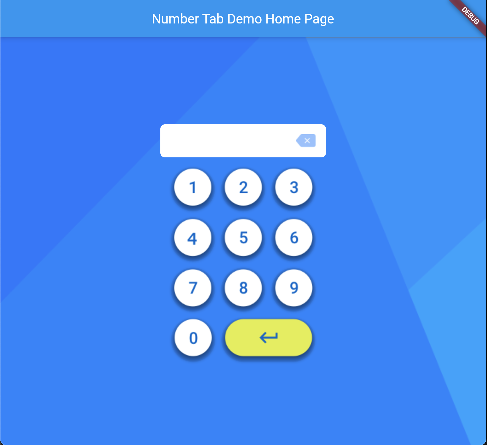

# Number Input Board

A Number Board with flutter


## How to use

```dart
NumberBoard(
    onEntered: (String number) {
        // user pressed enter
    },
    onValueChaged: (String number){
        // number changed
    },
    isPassword: false // option value, default is false, if want to hide user input as obscureText set it true.
),
```

